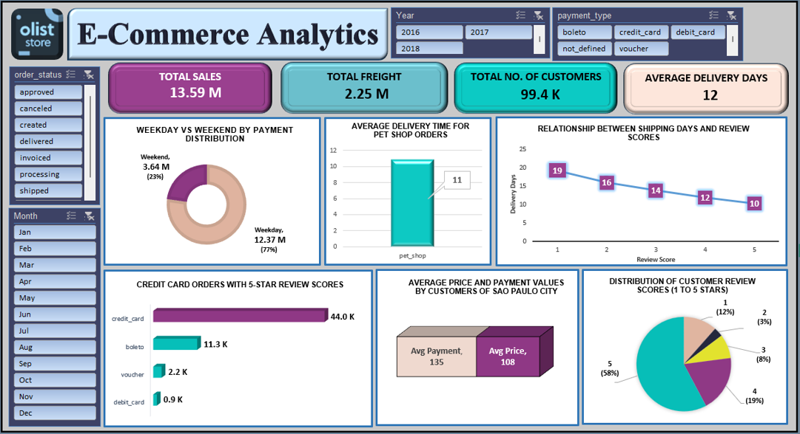
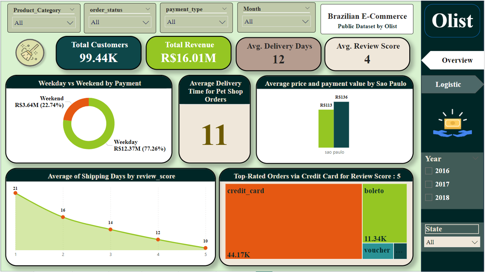
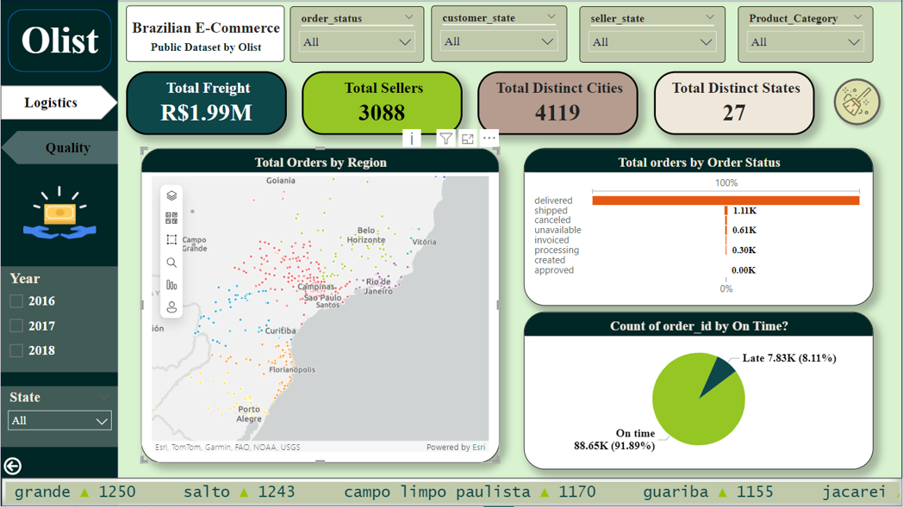
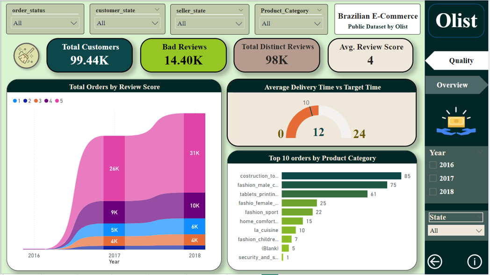
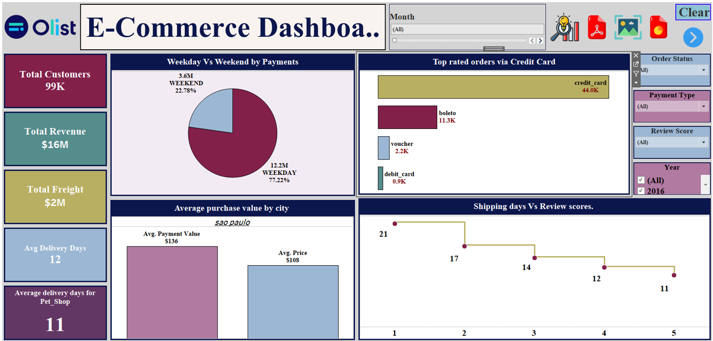
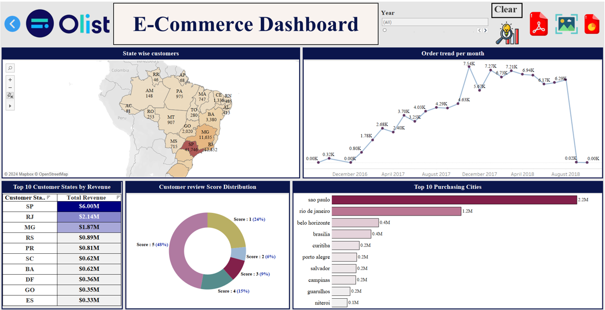

# Olist-data-analytics-project
End-to-End E-Commerce Analytics Project using Excel, SQL, Power BI &amp; Tableau
# 🛒 Olist E-Commerce Analytics Project

> **Internship Group Project** | Data Analytics | Excel | SQL | Power BI | Tableau


---

# 📌 Project Overview

This project analyzes the **Olist Brazilian E-Commerce Dataset**, which contains over **100,000 customer orders** from one of Brazil's largest online marketplaces between **2016 and 2018**.

The objective was to transform raw transactional data into meaningful business insights by performing **data cleaning, SQL analysis, KPI creation, and interactive dashboard development** using Excel, Power BI, and Tableau.

---

# 👨‍💻 My Contribution

This project was completed as part of a **3-member internship team**. My contributions included:

- Merged multiple datasets into a master dataset for analysis.
- Developed SQL queries to solve business problems.
- Designed KPIs and interactive dashboards in Excel, Power BI, and Tableau.
- Generated business insights and recommendations.
- Contributed to project documentation.

---

# 🎯 Business Objective

The project aims to help business stakeholders:

- Understand customer purchasing behavior
- Analyze payment preferences
- Monitor delivery performance
- Evaluate customer satisfaction
- Improve operational efficiency
- Support data-driven business decisions

---

# 📂 Dataset

- Dataset Name: Olist Brazilian E-Commerce Dataset
- Orders: 100,000+
- Time Period: 2016 – 2018
- Tables: 9 Relational Tables
- Dataset Size: ~45 MB

#### **Note:** The raw dataset is not included in this repository due to file size limitations.
---

# 🛠 Tech Stack

- Microsoft Excel
- MySQL
- Power BI
- Tableau

---

# 🔄 Project Lifecycle

### 1️⃣ Data Understanding
- Business objectives
- Dataset exploration
- Schema understanding

### 2️⃣ Data Cleaning
- Removed duplicates
- Handled missing values
- Corrected data types
- Fixed inconsistencies
- Standardized formats

### 3️⃣ Data Modeling
- Built table relationships
- Created analytical model
- SQL joins and transformations

### 4️⃣ Data Visualization
- Interactive dashboards
- KPI Cards
- Charts & Graphs
- Filters & Slicers

### 5️⃣ Dashboard Presentation
- Business KPIs
- Interactive Analysis
- Actionable Insights

---

# 📊 Key Performance Indicators

| KPI | Value |
|------|---------|
| 💰 Total Sales | 13.59M |
| 🚚 Total Freight | 2.25M |
| 👥 Total Customers | 99.4K |
| 📦 Average Delivery Time | 12 Days |

---

# ❓ Business Problems Solved

### 1. Weekday vs Weekend Payment Statistics

Analyzed purchasing behaviour based on weekdays and weekends.

---

### 2. Orders with 5-Star Reviews using Credit Card

Identified highly satisfied customers using Credit Card payments.

---

### 3. Average Delivery Time for Pet Shop Orders

Measured average delivery performance for Pet Shop products.

---

### 4. Average Price & Payment Value (São Paulo)

Compared customer spending behaviour in São Paulo.

---

### 5. Shipping Days vs Review Score

Studied how delivery speed influences customer satisfaction.

---

# 📈 Dashboard Features
- Executive KPI Cards
- Interactive Slicers & Filters
- Drill-down Analysis
- Dynamic Visualizations
- Payment Analysis
- Delivery Performance Tracking
- Customer Review Analysis
- Product Category Analysis
- Regional Sales Analysis
- Time-based Trend Analysis
- Sales & Freight KPIs

---

# 📊 Dashboard Preview

## 📈 Excel Dashboard – Executive Business Overview



---

## 📊 Power BI Dashboard – Executive Overview




## 🚚 Power BI Dashboard – Logistics




## ⭐ Power BI Dashboard – Customer Reviews & Quality Analysis



---

## 🌍 Tableau Dashboard – Executive Overview




## 📉 Tableau Dashboard – Customer & Regional Analysis



---


# 💡 Business Insights

### Weekday vs Weekend Sales

- 77% of purchases occur during weekdays.
- Weekend sales provide an opportunity for targeted promotions.

---

### Customer Satisfaction

- Majority of customers provided 5-star reviews.
- Credit Card users show higher satisfaction.

---

### Delivery Performance

- Faster deliveries consistently receive higher review scores.
- Improving logistics can significantly improve customer experience.

---

### São Paulo Market

- Customers from São Paulo demonstrate strong purchasing power.
- Region-specific marketing campaigns can improve sales.

---

### Payment Behaviour

- Credit Card remains the preferred payment method.
- Additional digital payment methods can further improve customer experience.

---

# 🚀 Business Recommendations

- Improve delivery logistics
- Launch weekday & weekend targeted campaigns
- Strengthen customer loyalty programs
- Optimize payment experience
- Expand regional marketing initiatives
- Monitor customer satisfaction continuously

---

# 📁 Repository Structure

```
Olist-ECommerce-Analytics
│
├── POWERBI
├── SQL
├── TABLEAU
├── dashboard-images
└── README.md
```

---

# 📷 Project Files

- Power BI Dashboard
- Tableau Dashboard
- SQL Queries
- Excel Dashboard Screenshots

---

# 📌 Conclusion

The project successfully transformed raw e-commerce data into actionable business insights through data cleaning, SQL analysis, KPI development, and interactive dashboards.

The analysis highlights customer purchasing behaviour, payment preferences, delivery performance, and satisfaction trends, helping businesses make informed strategic decisions and improve operational efficiency.

---
## 📬 Connect with Me

**Harshal Pednekar**

Aspiring Data Analyst | MIS Executive | Business Intelligence Enthusiast

- 💼 [LinkedIn](https://www.linkedin.com/in/harshal-pednekar-b59ba132b/)
- 💻 [GitHub](https://github.com/Harshal-Pednekar)

---

## ⭐ Support

If you found this project interesting or helpful, please consider giving this repository a ⭐.

Thank you for visiting!
